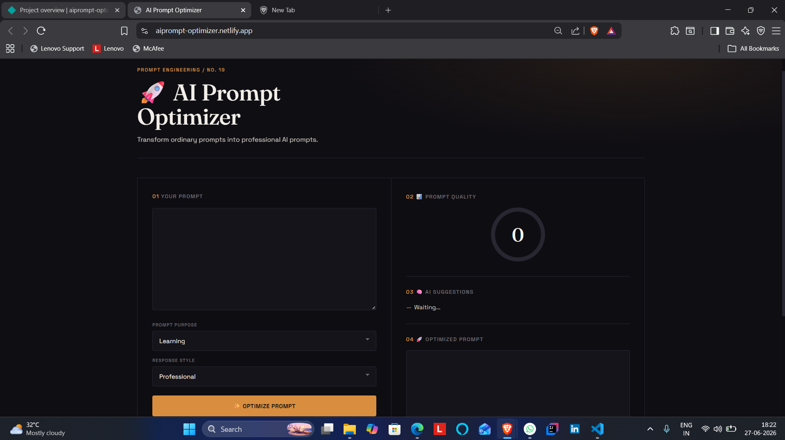
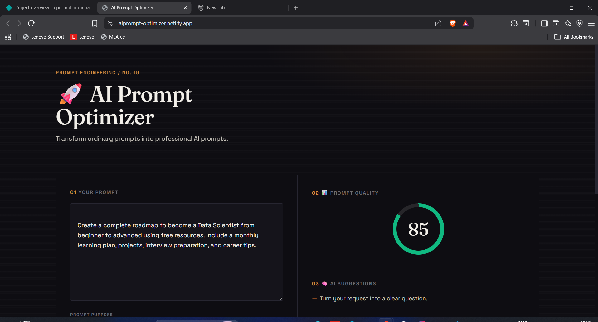
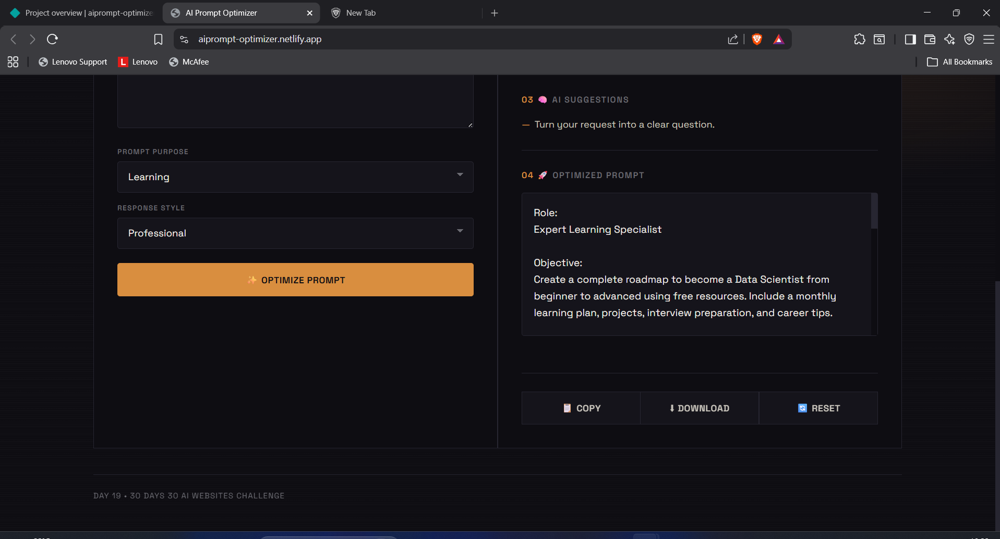

# AI Prompt Optimizer

## 🚀 Day 19 of my 30 Days 30 AI Websites Challenge

AI Prompt Optimizer Pro is an AI-inspired web application designed to help users write better prompts for AI tools such as ChatGPT, Gemini, Claude, Copilot, and other Large Language Models (LLMs).

Instead of sending short or unclear prompts, the platform analyzes the user's input, evaluates its quality, detects missing context, and transforms it into a more structured, detailed, and professional prompt.

The application also provides a Prompt Quality Score, improvement suggestions, and a downloadable optimized prompt, helping users communicate more effectively with AI systems.

## 🌐 Live Demo

https://aiprompt-optimizer.netlify.app/

## 📸 Screenshots

## ✨ Features

* Prompt Quality Analysis
* AI Prompt Optimization
* Smart Improvement Suggestions
* Purpose-Based Prompt Structuring
* Tone Selection
* Prompt Quality Score
* Dynamic AI Recommendations
* Copy Optimized Prompt
* Download Optimized Prompt
* Fully Responsive Design

## 📋 How It Works

1. Enter your prompt.
2. Select the prompt purpose.
3. Choose the preferred response style.
4. Click **Optimize Prompt**.
5. Review the quality score and AI suggestions.
6. Copy or download the optimized prompt for use with your favorite AI assistant.

## 🛠️ Technologies Used

* HTML
* CSS
* JavaScript
* Built with the help of AI-assisted development tools

## 🎯 Challenge Progress

✅ Day 19 Completed — AI Prompt Optimizer Pro

Part of my **30 Days 30 AI Websites Challenge**, where I build and publish one AI-powered web project every day to improve my frontend development, product-building, and problem-solving skills.

## 👨‍💻 Author

**Bettam Anand**
B.Tech CSE (Data Science)

JNTUH University College of Engineering Palair
